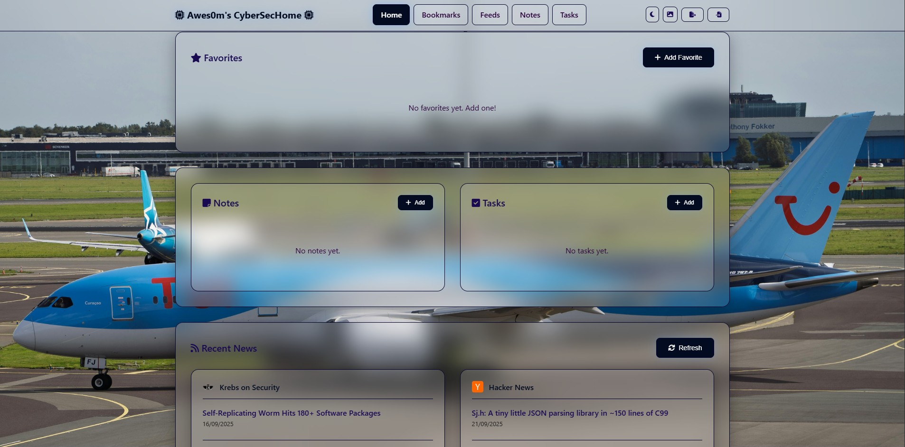

# Awes0m Cybersec Home


A customizable, self-contained browser homepage tailored for cybersecurity professionals. Features favorites, notes, tasks, bookmark import, news feeds, automation flows, and a floating toolkit panel.

[](https://github.com/awes0m/awesom_browser_tools/stargazers "Stargazers") [](https://github.com/awes0m/awesom_browser_tools/network/members "Forkers") []


<div align="center">
  <table>
    <tr>
      <td align="center">
        <a href="https://awes0m.github.io/CybersecHome/">
          
        </a>
      </td>
      <td align="center">
        <a href="https://github.com/awes0m/CybersecHome/raw/refs/heads/main/awesom_cybersec_home.zip">
          
        </a>
      </td>
    </tr>
  </table>
</div>
---



## Features

### 🌟 Core

- **Responsive Design**: Desktop, tablet, mobile
- **Dark/Light Theme**: Toggle with persistence
- **Self-contained**: Single HTML file, optional samples
- **Local Storage**: All data persists in your browser
- **Accessible UI**: Keyboard and screen-reader friendly structure

### 🧭 Navigation & Layout

- **Fixed glassmorphism header** with logo and page navigation
- **Client-side page switching**: Home, Bookmarks, Notes, Tasks, Feeds (single-page experience)
- **Collapsible sections** with subtle hover/transition effects
- **Scrollable content areas** for Favorites, Notes, and Tasks to keep the layout compact
- **Optional wallpaper overlay** layer behind the gradient background for personalization

### 📌 Favorites

- Add, edit, and delete favorite links
- Font Awesome icon support (e.g., `fab fa-github`)
- Clickable tiles with hover animations and quick delete
- Grid layout with responsive columns

### 📝 Notes

- Create, update, delete text notes
- Per-note title and content
- Smooth card UI with hover motion

### ✅ Tasks (Todos)

- Create, update, delete tasks
- Set due dates; overdue tasks highlighted
- Mark complete/incomplete; clear completed

### 📚 Bookmark Import

- Drag-and-drop or click-to-upload a standard `bookmarks.html` exported from Chrome/Firefox/Edge/Safari
- Automatic parsing and folder grouping
- Favicon display when available

### 📰 News Feeds (with custom sources)

- Predefined cybersecurity sources (e.g., Krebs on Security, Hacker News, CISA Advisories)
- Add custom RSS feed sources
- Real-time refresh with RSS parsing via rss2json API
- Individual feed deletion for custom sources

### 🚀 Automations/Ops Flows

- Create automation flows to open multiple URLs simultaneously
- Add URLs manually or select from existing bookmarks
- Pre-configured actions for common security workflows (e.g., "Morning Ops")
- Launch flows with confirmation dialog to manage popup blocking

### 🛠️ CS Toolkit Panel

- Draggable floating panel with quick access to cybersecurity tools
- Organized categories: Reporting, Investigation Tools, Online Services
- Tools include: Security Incident Response Generator, JSON tools, CyberChef, VirusTotal, Shodan, AlienVault OTX, and more
- Toggle visibility with corner button (mobile hidden by default)

---

## What's New / Recent Improvements

- **Automations/Ops Flows**: Create and launch automation flows to open multiple URLs simultaneously for rapid access to grouped tools.
- **CS Toolkit Floating Panel**: Draggable sidebar with quick links to cybersecurity investigation tools (VirusTotal, Shodan, CyberChef, etc.).
- **IndexedDB Persistence**: Upgraded from localStorage to IndexedDB for better data capacity and performance.
- **Enhanced Bookmark Management**: Organize bookmarks into folders, add from bookmarks to favorites, and search across all bookmarks.
- **Search Filtering**: Real-time filtering across Notes, Tasks, and Bookmarks for quick information retrieval.
- **Database Backup/Restore**: Export and import all data as JSON for backup and migration purposes.
- **Scrollable modules**: Favorites, Notes, and Todos sections are scrollable with custom scrollbar styling.
- **Theme polish**: Refined dark theme variables and shadows.
- **Glass UI updates**: Consistent borders, hover elevation, and blur.

---

## Data Flow and Architecture

The homepage is a simple, modular, client-side app built with vanilla HTML/CSS/JS. It uses IndexedDB for persistence with automatic migration from older localStorage format.

### High-Level Flow

1. **Boot**
   - Initialize IndexedDB connection and create object stores (favorites, notes, todos, bookmarks, feeds, automations, settings).
   - Check for legacy localStorage data and migrate if needed.
   - Load settings (theme, wallpaper) from the settings store.
   - Render initial page and attach event listeners.
2. **User Interaction**
   - UI events (click, submit, drag/drop, toggle) trigger handler methods.
   - Handlers create/update/delete items and call `db.put()` or `db.delete()` to persist.
3. **Render**
   - After each change, the relevant section re-renders by fetching fresh data via `db.getAll()`.
4. **Persist**
   - Data is automatically saved to IndexedDB; on reload, the UI restores from persisted state.

### Module Responsibilities

- **Favorites**: Manage favorite link objects; render grid; delete via inline button; full CRUD operations; persist to `favorites` store.
- **Notes**: Create, read, update, delete note objects with `title` and `content`; search filtering; persist to `notes` store.
- **Todos**: Manage task objects with `text` and `completed` status; toggle completion; search filtering; persist to `todos` store.
- **Bookmarks**: Parse imported HTML from browsers, organize into folders, add individual bookmarks, search across all bookmarks; persist to `bookmarks` store.
- **Feeds**: Fetch RSS feeds via rss2json API, display latest articles, manage custom feeds; persist to `feeds` store.
- **Automations**: Create workflows with multiple URLs, launch flows to open multiple tabs; integrate with bookmarks; persist to `automations` store.
- **CS Toolkit Panel**: Draggable sidebar with organized tool links; toggle visibility; no persistence required.
- **Theme**: Toggle attribute on `<body>` (e.g., `data-theme="dark"`); persist to `settings` store with other preferences.
- **Database**: Export/import all data as JSON backup; migrate from older localStorage format to IndexedDB.

### Event → State → Storage → UI

- Example (Add Favorite):
  1) User submits form → 2) Create favorite object → 3) Call `db.put('favorites', newFav)` → 4) Re-render favorites grid by calling `db.getAll('favorites')`.
- Example (Toggle Theme):
  1) Click theme button → 2) Flip `data-theme` → 3) Call `db.put('settings', { id: 'preferences', theme: 'dark'|'light', ... })` → 4) CSS variables update theme instantly.
- Example (Import Bookmarks):
  1) Drop file → 2) Read/parse bookmark HTML → 3) Map to normalized folder entries → 4) Call `db.put('bookmarks', folder)` for each folder → 5) Render grouped view with favicons.

---

## Data Persistence (IndexedDB)

The app uses **IndexedDB** for persistent storage instead of localStorage, allowing for larger data capacity and better performance. Data is organized into the following object stores:

### Favorites Store
```json
{
  "id": 1694000000,
  "name": "GitHub",
  "url": "https://github.com",
  "icon": "fab fa-github"
}
```

### Notes Store
```json
{
  "id": 1694000001,
  "title": "Meeting Notes",
  "content": "Discussion points...",
}
```

### Todos Store
```json
{
  "id": 1694000002,
  "text": "Complete security review",
  "completed": false
}
```

### Bookmarks Store (Folder-based)
```json
{
  "id": "f_1694000003",
  "name": "Security Resources",
  "bookmarks": [
    {
      "id": "bm_1694000004",
      "title": "OWASP",
      "url": "https://owasp.org"
    }
  ]
}
```

### Feeds Store
```json
{
  "id": 1694000005,
  "name": "Custom Security Feed",
  "url": "https://example.com/feed.xml"
}
```

### Automations Store
```json
{
  "id": 1694000006,
  "name": "Morning Ops",
  "urls": [
    "https://virustotal.com",
    "https://shodan.io",
    "https://urlscan.io"
  ]
}
```

### Settings Store
```json
{
  "id": "preferences",
  "theme": "dark",
  "wallpaper": "https://example.com/image.jpg",
  "searchEngine": "google"
}
```

---

## Setup

### Quick Start

1. Download and extract: https://github.com/awes0m/awesom_browser_tools/raw/refs/heads/main/awesom_cybersec_home.zip
2. Open `index.html` directly in your browser, or host via a simple local server.

### Set as Browser Homepage (Local File)

Set your homepage to the local file path, for example:

```text
file:///C:/Users/You/Downloads/awesom_browser_tools/index.html
```

Step-by-step guides are provided for Chrome, Firefox, Edge, Safari, Opera, and Brave in this README (search for your browser).

### Run a Local Server (Recommended)

To avoid any file URL restrictions and for best performance:

```bash
# Python
python -m http.server 8000
# Node.js
npx http-server
# PHP
php -S localhost:8000
```

Then open http://localhost:8000

---

## Usage

### Favorites

1. Click "Add Favorite".
2. Provide Label, URL, and Font Awesome icon class.
3. Submit to save; tile appears in the grid. Hover to reveal quick delete.

### Notes

1. Click "Add Note".
2. Enter title and content. Notes are listed with latest first.

### Tasks

1. Click "Add Task".
2. Enter description and optional due date.
3. Overdue tasks are styled distinctly; mark complete when done.

### Bookmark Import

1. Export from your browser as HTML.
2. Drag-and-drop the file onto the import area, or click to select.
3. Bookmarks are parsed and grouped by folder with favicons.

### Automations/Ops Flows

1. Click "Ops" in the navigation menu.
2. Click "Create Flow" button.
3. Enter a name for the flow (e.g., "Morning Ops").
4. Add URLs either:
   - Manually (one per line) in the "URLs" textarea
   - Select from existing bookmarks using the "Add from Bookmarks" dropdown
5. Click "Save Flow" to create the automation.
6. Launch the flow by clicking the "Launch" button; confirm the popup permission dialog.

### Database Backup & Restore

1. Click the database icon (or settings gear) in the header to open "Data & Settings".
2. **To backup**: Click "Download Backup" to export all data as a JSON file.
3. **To restore**: Click "Restore from Backup", select a previously saved JSON file, and confirm. (Warning: This replaces current data.)

### Wallpaper

1. Open "Data & Settings" (database or settings icon in header).
2. Enter an image URL (e.g., `https://example.com/image.jpg`).
3. Click "Set Wallpaper" to apply the custom background.

### Theme

- Use the theme toggle (sun icon) in the header. The choice is saved and restored on next visit.

---

## Browser Support

- **Modern Browsers**: Chrome 80+, Firefox 75+, Safari 13+, Edge 80+
- **Mobile**: iOS Safari, Chrome Mobile, Samsung Internet
- **APIs Used**: CSS Grid/Flexbox, IndexedDB, File API, Fetch API, CSS custom properties, LocalStorage (legacy migration)

---

## Development Notes

- **Single-file architecture**: All code (HTML/CSS/JS) is self-contained in `index.html` for easy distribution and offline use
- **IndexedDB for persistence**: Uses browser's IndexedDB API for robust client-side data storage with larger capacity than localStorage
- **Modular class structure**: `DBService` handles all database operations; `App` class manages UI and business logic
- **RSS parsing**: Uses rss2json API to fetch and parse RSS feeds (bypasses CORS restrictions)
- **Draggable UI components**: CS Toolkit panel uses vanilla JS drag implementation for better UX
- **Minimal dependencies**: No external frameworks; uses vanilla HTML5, CSS3, and JavaScript
- **Responsive design**: CSS Grid/Flexbox with mobile-first approach; floating panel hidden on mobile

---

## Troubleshooting

### Bookmarks Not Importing

- Ensure the file is a valid HTML bookmark export from Chrome, Firefox, Edge, or Safari
- Check browser console (F12 → Console) for parsing errors
- Try the provided sample `sample-bookmarks.html` file

### Favicons Not Loading in Bookmarks

- Some sites block favicon requests; a default icon appears when unavailable
- Favicon resolution uses Google's favicon service

### Feeds Not Loading or Showing "Failed"

- Verify the RSS URL is correct and publicly accessible
- Check that the feed is a valid XML/RSS format
- Some feeds may require a proxy if they have CORS restrictions
- The app uses rss2json API to parse feeds; if it's unavailable, feeds will fail to load

### Data Not Persisting

- Confirm IndexedDB is enabled in browser settings (not just localStorage)
- Avoid private/incognito mode if you want data to persist long-term
- Check browser's storage quota hasn't been exceeded
- Clearing browser data/cache may delete IndexedDB; use Backup feature to save important data

### Automations Not Opening Tabs

- Browser may block popups by default; allow popups for this site in browser settings
- Some URLs may be blocked by browser security policies
- Confirm URLs are valid and don't have typos

---

## File Structure (Repo)

```
awesom_browser_tools/
├── index.html                 # Main homepage (self-contained)
├── README.md                  # This documentation
├── sample-bookmarks.html      # Sample bookmark export
├── sample-data.json           # Sample data structures
├── backdown.html              # Additional demo/test page
└── awesom_cybersec_home/      # Unzipped distribution (index + docs)
```

---

## Contributing

### Add New Sections

1. Create the HTML structure in `index.html` (new page div and modal overlays)
2. Style with CSS variables and shared classes (see `:root` and `[data-theme="dark"]`)
3. Implement JS logic in the `App` class; create new methods for rendering and event handling
4. Add new IndexedDB store in `DBService.init()` and expose get/put/delete methods
5. Integrate with the settings modal if user preferences are needed

### Extend Existing Features

- **Add more CS Toolkit links**: Edit the `.panel-content` section with new tool categories and links
- **Add RSS feed sources**: Modify the `feedSources` array in the `App` constructor
- **Create new automation templates**: UI allows freeform URL input; consider pre-filling with common workflows
- **Enhance bookmark organization**: Add tags, color labels, or hierarchical folder structures

### Extend Data Models

1. Add new object store in `DBService.init()` (in the `onupgradeneeded` callback)
2. Implement async methods for CRUD operations on the new store
3. Create render functions in the `App` class
4. Add form modals for user input
5. Implement search/filter functionality if needed
6. Ensure the export/import functions include the new store

### Development Guidelines

- Use `escapeHtml()` to prevent XSS when rendering user-generated content
- Use timestamps (`Date.now()`) for auto-generated IDs
- Maintain CSS variable consistency for theme support
- Test in both light and dark themes
- Ensure mobile responsiveness (test at 768px breakpoint)

PRs welcome for usability improvements, accessibility, performance, bug fixes, and new features!
