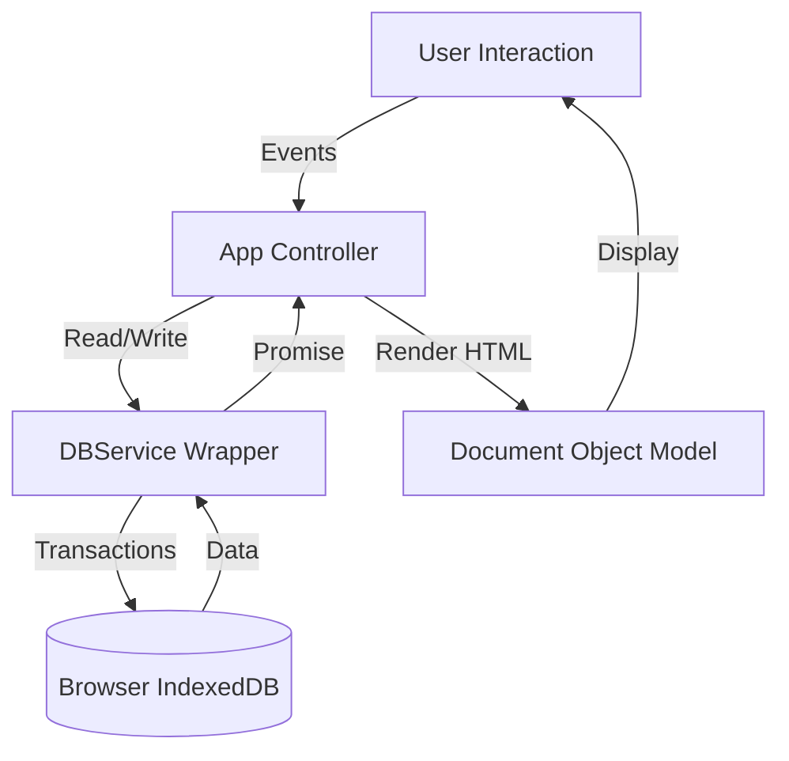

# 📘 Awes0m Cybersec Homepage v2.2 - Technical Documentation

## 1\. System Architecture

The application is designed as a **Single-Page Application (SPA)** contained entirely within one `index.html` file. It operates offline (except for external API calls like RSS feeds/Search) and uses the browser's native **IndexedDB** for persistent, large-scale storage.

**Core Components:**

  * **View Layer:** HTML5 + CSS3 (Variables for theming).
  * **Controller Layer:** The `App` class in JavaScript.
  * **Data Layer:** The `DBService` class wrapping IndexedDB APIs.

### Data Flow Diagram

-----

## 2\. Database Schema (IndexedDB)

**Database Name:** `AwesomDB`
**Version:** `1`

The database consists of **7 Object Stores**. All stores use `id` as the unique KeyPath.

| Object Store | Description | Key Fields |
| :--- | :--- | :--- |
| **`favorites`** | Dashboard quick links | `id`, `name`, `url`, `icon` |
| **`notes`** | Text-based notes | `id`, `title`, `content` |
| **`todos`** | Task list items | `id`, `text`, `completed` (boolean) |
| **`bookmarks`** | Folder-based bookmark structures | `id`, `name` (Folder Name), `bookmarks` (Array of objects) |
| **`feeds`** | RSS Feed sources | `id`, `name`, `url` |
| **`automations`** | Tool groups for bulk launching | `id`, `name`, `urls` (Array of strings) |
| **`settings`** | App configuration | `id` ("preferences"), `theme`, `wallpaper` |

-----

## 3\. Class Definitions & Function Mappings

### A. `class DBService`

Handles all low-level interactions with the browser's IndexedDB API.

| Method | Signature | Description |
| :--- | :--- | :--- |
| **`init`** | `async init()` | Opens the DB connection. Handles `onupgradeneeded` to create object stores if they don't exist. |
| **`getAll`** | `async getAll(storeName)` | Opens a `readonly` transaction and retrieves all records from the specified store. |
| **`put`** | `async put(storeName, item)` | Opens a `readwrite` transaction to insert or update an item. |
| **`delete`** | `async delete(storeName, id)` | Opens a `readwrite` transaction to remove an item by its ID. |
| **`exportDatabase`** | `async exportDatabase()` | Iterates through **all** stores, bundles data into a JSON object (`{version, timestamp, storeData...}`), creates a `Blob`, and triggers a browser download. |
| **`importDatabase`** | `async importDatabase(file)` | Reads a JSON file via `FileReader`. Clears **all** current data in stores and bulk-inserts the imported data. Triggers a page reload on success. |

### B. `class App`

The main controller that bridges the UI (DOM) and the Database.

#### Initialization & Core Logic

  * **`constructor()`**: Initializes state (theme, search engine preference) and default feed sources.
  * **`init()`**:
    1.  Awaits `this.db.init()`.
    2.  **Legacy Migration**: Checks `localStorage` for v1 data. If found, migrates to IndexedDB and clears local storage.
    3.  Calls `loadSettings()` to apply theme/wallpaper.
    4.  Calls `startClock()` for the live timer.
    5.  Calls `renderAll()` to paint the UI.
    6.  Calls `setupEvents()` to bind DOM listeners.

#### Renderers (View Logic)

These functions fetch data from `DBService` and generate HTML strings using template literals.

  * **`renderFavorites()`**: Renders the quick access grid.
  * **`renderNotes()`**: Renders "Recent Notes" (slice 0-3) for dashboard and "All Notes" (filtered by search) for the Notes page.
  * **`renderTodos()`**: Sorts tasks by completion status. Renders "Recent" list and "All Tasks" list.
  * **`renderAutomations()`**: Renders cards for automation flows.
  * **`renderBookmarks()`**: Renders folders and their nested bookmarks. Handles search filtering logic.
  * **`loadFeeds()`**:
    1.  Combines default hardcoded feeds with custom feeds from DB.
    2.  Fetches XML via `api.rss2json.com`.
    3.  Renders the Feed Grid. Handles API errors gracefully.

#### Business Logic Functions

  * **`startClock()`**: Runs a 1-second interval to update `#clockDisplay`, `#dateDisplay`, and calculates the greeting (Morning/Afternoon/Evening).
  * **`handleBookmarksFile(file)`**:
      * **Input**: Netscape Bookmark HTML file.
      * **Process**: Uses `DOMParser` to find `<DT><H3>` (Folders) and `<DT><A>` (Links).
      * **Output**: Structs data into Folder objects and persists via `db.put('bookmarks')`.
  * **`runAutomation(id)`**: Looks up automation by ID. Iterates through the `urls` array and calls `window.open(url, '_blank')` for each.
  * **`setWallpaper()`**: Updates the `wallpaper-overlay` div and persists the URL to `settings` store.

-----

## 4\. UI/DOM Event Listeners

The `setupEvents()` method acts as the central registry for user interactions.

| UI Element | Event | Action |
| :--- | :--- | :--- |
| **Nav Links** (`.nav-link`) | `click` | Hides all `.page` divs, shows the target page (`active` class toggling). |
| **Theme Toggle** (`#themeToggle`) | `click` | Toggles `data-theme` on `<body>` between light/dark. Saves to DB. |
| **Search Form** (`#searchForm`) | `submit` | Checks toggle state. Redirects to `google.com` or `perplexity.ai`. |
| **Modals** (Various) | `submit` | Prevents default submission. Harvests input values. Calls `db.put()`. Closes modal. Re-renders specific section. |
| **Inputs** (Search Bars) | `input` | Triggers live re-rendering of lists (Notes, Bookmarks, Todos) for filtering. |
| **Import Input** (`#bmImportInput`) | `change` | Triggers `handleBookmarksFile` when a file is selected. |

-----

## 5\. CSS & Theming System

The app uses **CSS Variables** defined in `:root` and `[data-theme="dark"]` to handle styling dynamically.

**Key Variables:**

  * `--bg-primary`: Main background for cards/headers (Glassmorphism effect).
  * `--accent-color`: Primary action color (Blue/Cyan variants).
  * `--glass-blur`: Controls the backdrop-filter intensity (set to `20px`).

**Responsive Design:**

  * **Desktop**: 1400px max-width container. 2-column split for Notes/Tasks.
  * **Mobile (\<768px)**: Collapses grids to 1 column. Adapts font sizes for the Clock.

-----

## 6\. External Dependencies

1.  **Font Awesome**: `cdnjs.cloudflare.com/.../all.min.css` (Icons).
2.  **RSS2JSON API**: `api.rss2json.com` (Converts XML feeds to JSON for the frontend).
3.  **Google Favicons**: `www.google.com/s2/favicons` (Fetches icons for bookmarks).